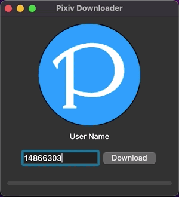

  
   

## Links
- [Download](https://github.com/c13h12n4o2/Pixiv_Downloader/releases/latest)
- [Issues](https://github.com/c13h12n4o2/Pixiv_Downloader/issues)
- [Wiki](https://github.com/c13h12n4o2/Pixiv_Downloader/wiki)

## Demo

  
   

## Features
- 🍰 간단하고 깔끔한 사용자 인터페이스
- 🚀 빠른 다운로드 속도
- 🛠 일러스트, 만화, 움직이는 일러스트 다운로드

## Dependencies
| Dependency | Version | Link |
| :--: | -- | -- |
| **Pixiv_Crawler** | 1.0.0 | [Link](https://github.com/C13H12N4O2/Pixiv_Crawler) |
| **PyQt6** | 6.2.2 | [Link](https://pypi.org/project/PyQt6/) |
